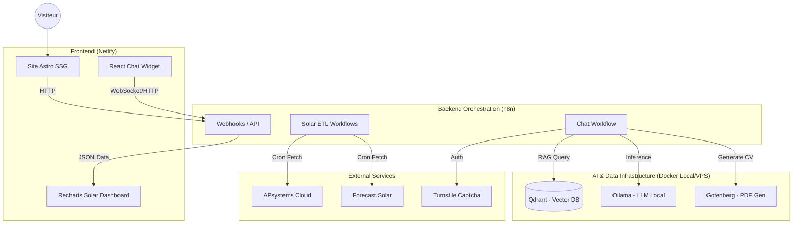

# 🏗️ Architecture Globale & Roadmap - Gehringer.fr

## 🧠 Guide pour l'IA
Ce document est la **clé de voûte** de la documentation technique. Il relie :
- Le Frontend (décrit dans `frontend-astro-geh-website-doc.md`)
- Le Backend & Données (décrit dans `backend-n8n-solar-data-doc.md`)

Il présente la **vision produit**, l'**architecture système complète**, et la **roadmap**.

---

## 🌟 Vision & Concept du Projet

### "Tech for Good & Professional Expertise"
Le site **gehringer.fr** est bien plus qu'une simple vitrine professionnelle. Il incarne la double expertise de Philippe Gehringer :
1.  **Management de Transition & RSE** : Une vitrine statique, élégante et rapide montrant l'expérience et l'engagement pour le développement durable (Bilan Carbone, Fresque du Climat).
2.  **Innovation & IA** : Une démonstration technique discrète mais puissante via un Chatbot IA avancé et un Dashboard Solaire temps réel.

### Les deux visages du site
| Face "Vitrine" (Statique) | Face "Tech" (Dynamique) |
|---------------------------|-------------------------|
| **Public cible** : Recruteurs, Clients, Prospects | **Public cible** : Technophiles, Curieux, Moi-même |
| **Techno** : Astro, HTML/CSS pur | **Techno** : React, n8n, Qdrant, Ollama, Docker |
| **Objectif** : Rassurer, Informer, Convaincre | **Objectif** : Démontrer, Calculer, Interagir |
| **Pages** : Accueil, Services, Parcours, Contact | **Modules** : Chatbot IA, Dashboard Solaire |

---

## 🏛️ Architecture Système Globale

### Diagramme de Flux

### 1. Frontend : La Vitrine (Astro)
Le frontend est construit sur **Astro**, privilégiant la performance (SSG).
- **Pages Publiques** : 
  - `index` (Accueil)
  - `services` (Offre de valeur)
  - `parcours` (Timeline expérience)
  - `contact` (Formulaire Netlify)
- **Pages "Privées"** :
  - `solar` : Dashboard technique (actuellement ouvert, sécurisation prévue).
- **Composants Clés** :
  - `ChatWidget.jsx` : Porte d'entrée vers l'IA, présente sur toutes les pages.

### 2. Backend : L'Orchestre (n8n)
n8n agit comme le **backend universel**. Il ne stocke pas la logique métier complexe dans le code, mais l'orchestre visuellement.
- **Rôle** : API Gateway, ETL (Extract, Transform, Load), Orchestrateur IA.
- **Hébergement** : Serveur avec accès aux containers Docker (IA).

### 3. Infrastructure IA (Le "Cerveau")
C'est ici que réside la valeur ajoutée technologique cachée.
- **Qdrant (Mémoire Long Terme)** :
  - Base de données vectorielle stockant l'expérience professionnelle ("Collection `experience_pro`").
  - Permet le **RAG (Retrieval-Augmented Generation)** : Le chatbot ne "hallucine" pas mon CV, il le "lit" dans Qdrant.
- **Ollama (Intelligence)** :
  - Fait tourner des LLM locaux (ex: `gemma` pour embeddings, `llama3` pour chat).
  - Garantit la confidentialité et l'autonomie.
- **Gotenberg (Génération de Documents)** :
  - API de conversion HTML/Markdown vers PDF.
  - **Cas d'usage** : Si un recruteur demande un CV ou une lettre de motivation adaptée, l'IA génère le contenu, Gotenberg crée le PDF, et le chatbot l'envoie.

---

## 🔄 Flux Fonctionnels Majeurs

### A. Le Chatbot Intelligent (Recrutement & Lead Gen)
1. **Entrée** : L'utilisateur clique sur la bulle.
2. **Identification** : Email demandé (Mini-CRM dans n8n) + Captcha Turnstile.
3. **Dialogue** :
   - Question utilisateur -> n8n -> Embedding (Ollama) -> Recherche vectorielle (Qdrant) -> Génération réponse (Ollama).
4. **Action** : 
   - Si demande de CV -> n8n génère le PDF via Gotenberg et le livre dans le chat.
   - Upload de fichier -> Analyse par l'IA pour matching de compétences.

### B. Dashboard Solaire (Data Visualization)
1. **Acquisition** : n8n récupère les données toutes les heures (APsystems, Météo).
2. **Stockage** : n8n Data Tables (tampon 48h) + Google Sheets (Historique).
3. **Restitution** : Le frontend appelle les Webhooks n8n pour afficher les graphes Recharts.

---

## 🗺️ Roadmap & Évolutions

### Phase 1 : Consolidation (Actuel)
- [x] Site vitrine Astro performant.
- [x] Dashboard Solaire fonctionnel (données live).
- [x] Chatbot v1 (RAG basique sur expérience pro).
- [x] **Sécurisation Chatbot** : Auth forte, Refresh Tokens, Rate Limiting, Audit Logs.
- [ ] **Priorité** : Manque : Cleanup Tokens Expirés. Impact : La table Active_Tokens va croître indéfiniment.
- [ ] **Priorité** : Cohérence documentaire (ce document).

### Phase 2 : Professionnalisation (Court Terme)
- **Frontend** :
  - [ ] **SEO Avancé** : `robots.txt`, `sitemap.xml`, balises schema.org pour "Person" et "ProfessionalService".
  - [ ] **Performance** : Lazy loading des composants lourds (Charts, Chat).
- **Chatbot** :
  - [ ] **Contexte Page** : Le chatbot sait sur quelle page est l'utilisateur (ex: Propose de parler "Solaire" si sur `/solar`).
  - [ ] **Offre de service dynamique** : Génération de propositions commerciales simples via Gotenberg.

### Phase 3 : Extension & Sécurité (Moyen Terme)
- **Sécurité** :
  - [ ] Verrouillage de la page `/solar` (Auth via n8n ou Netlify Identity).
- **Internationalisation (i18n)** :
  - [ ] Version anglaise du site (indispensable pour le profil international).
- **Nouvelles Collections IA** :
  - [ ] RAG sur d'autres sujets (ex: RSE, Tech Watch).

### Phase 4 : Plateforme Client (Long Terme)
- [ ] Espace client authentifié.
- [ ] Accès à des documents privés générés par l'IA.

---

## 📚 Références Documentaires
- Pour les détails côté **Frontend** (Composants, Design System, Déploiement) :  
  👉 Voir `frontend-astro-geh-website-doc.md`
- Pour les détails côté **Données & Workflows** (Tables, APIs, Champs) :  
  👉 Voir `backend-n8n-solar-data-doc.md`
- Pour les détails de **Sécurité & Authentification Chatbot** :
  👉 Voir `backend-chat-api-security.md`
